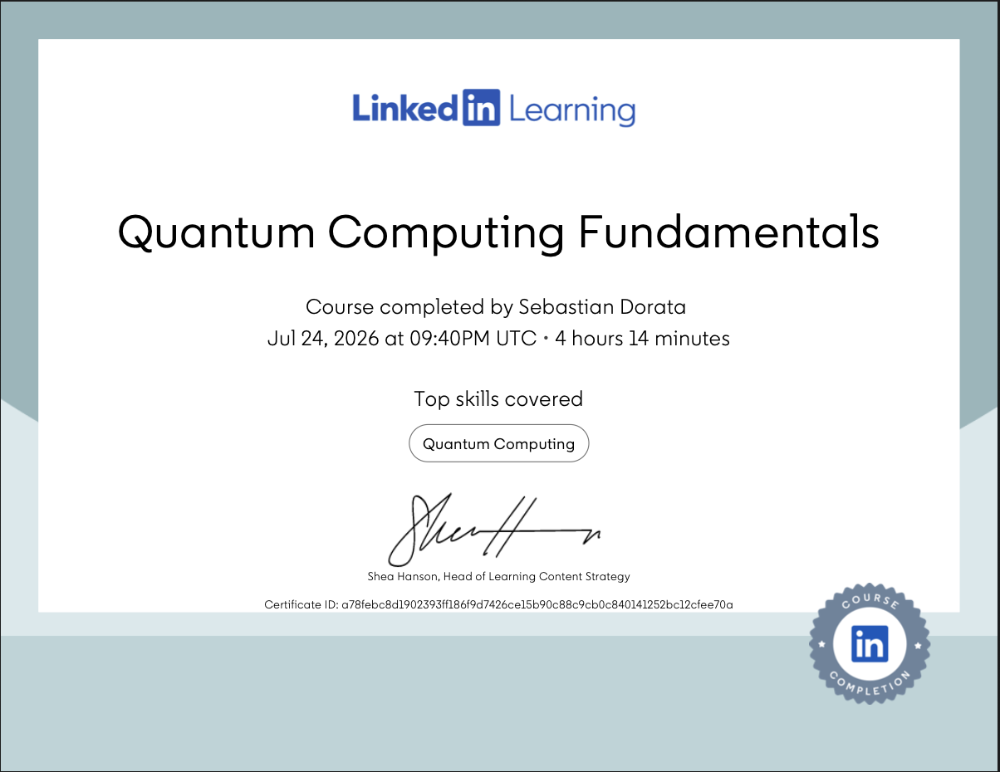

# Quantum Computing Fundamentals — Self-Learning Notes

This repository contains my personal notes and progress from working through **[Quantum Computing Fundamentals](https://www.linkedin.com/learning/quantum-computing-fundamentals)** by Barron Stone and Olivia Stone on LinkedIn Learning.

---

## Why I Took This Course

While scrolling on TikTok, a creator I follow ([@ccna.with.kevin](https://www.tiktok.com/@ccna.with.kevin/video/7649860310437727501?_r=1&_t=ZS-97aWvjzJLeh)) posted a video about quantum networking. I had never heard of the topic before, and it immediately caught my interest.

Over the next few days, I began exploring the topic by watching YouTube videos, most notably two Cisco Live lectures by Tim Szigeti, Distinguished Engineer at Cisco Systems:

- [Inside Cisco's Quantum Networking Research | Innovation, Development & Incubation](https://www.youtube.com/watch?v=iZDJPomuo70)
- [An Introduction to Quantum Mechanics, Computing, and Networking](https://www.youtube.com/watch?v=-owuoXUelSg)

From there, I took advantage of LinkedIn Learning access provided through York University and completed a couple of introductory courses:

- **Quantum Cryptography and the Future of Cybersecurity** by Jonathan Reichental, PhD — [link](https://www.linkedin.com/posts/sebastian-dorata-5013b6297_cryptography-quantumcomputing-share-7476465254089113600-u0wS/?utm_source=share&utm_medium=member_desktop&rcm=ACoAAEfIulEBFee_AmIC7rSD54Gw9uVajttQP80)
- **Quantum Networking** by Pearson — [link](https://www.linkedin.com/posts/sebastian-dorata-5013b6297_dataprivacy-computernetworking-quantumcomputing-share-7476403769056968704-UGq4/?utm_source=share&utm_medium=member_desktop&rcm=ACoAAEfIulEBFee_AmIC7rSD54Gw9uVajttQP80)

Both were interesting, but I wanted something more challenging and in-depth to keep building on that initial curiosity. That search led me to **Quantum Computing Fundamentals** by Barron Stone and Olivia Stone, which this repository documents.

---

## About This Repository

This repo is a personal study log, not an official course resource. It exists so I can:

- Track my own progress through the course
- Reinforce concepts through active note-taking rather than passive watching
- Build a quick-reference resource I can revisit later
- Share my learning journey publicly on GitHub

## How the Notes Are Written

The notes in this repository are written the way I'd write lecture notes for my own study — as a mix of direct quotes, paraphrasing, and reorganization, depending on what helps me learn and remember the material best. Some sections are copied word-for-word from the course where the original phrasing was clear and worth preserving exactly (e.g., definitions or key explanations); other sections are paraphrased or restructured in my own words. These notes are a personal study aid, not an original or transformative work — all credit for the content belongs to the original instructors.

## Citation

The notes in this repository are derived from:

> Stone, B., & Stone, O. *Quantum Computing Fundamentals*. LinkedIn Learning.
> https://www.linkedin.com/learning/quantum-computing-fundamentals

All credit for the underlying concepts, structure, and course content belongs to the original instructors. This repository is intended solely for personal educational use and is not a substitute for the original course. If you're interested in this topic, I'd strongly recommend taking the course directly.

---

